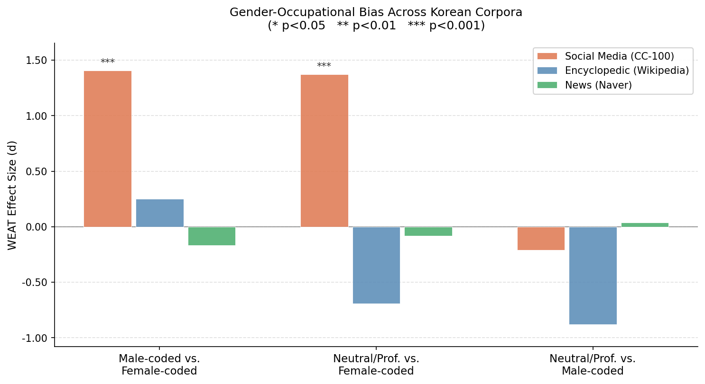
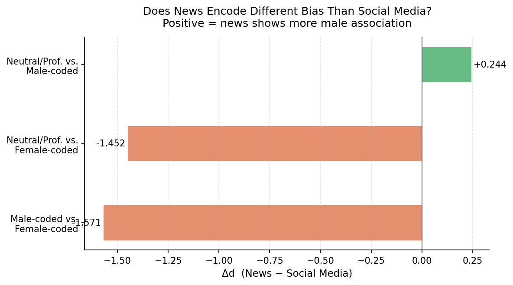
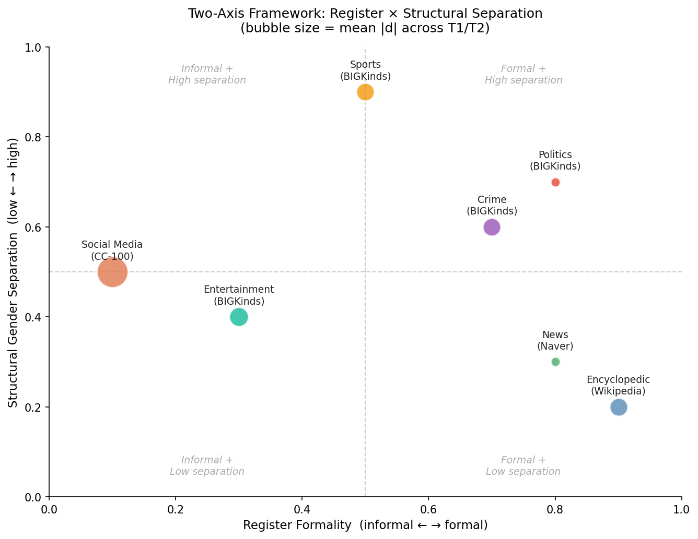
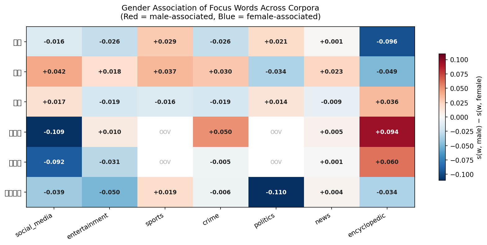
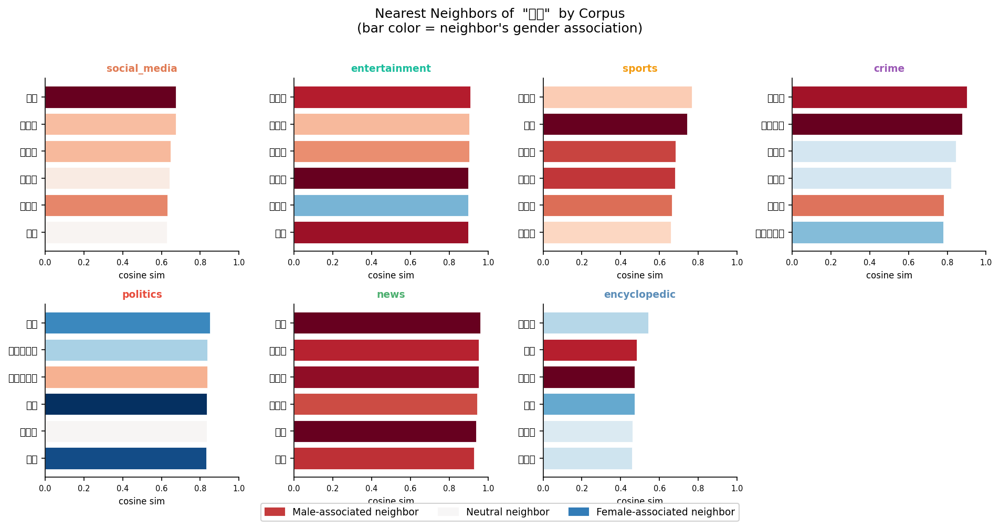
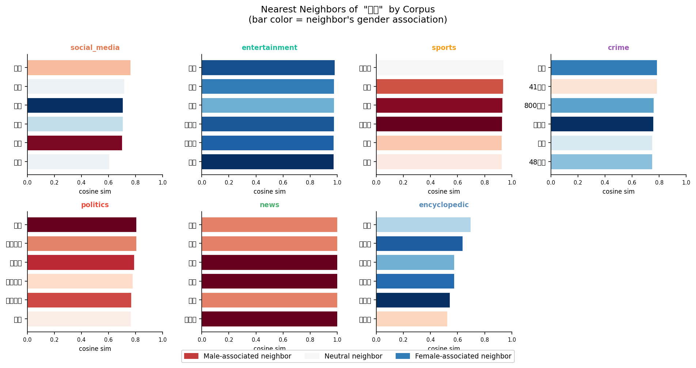
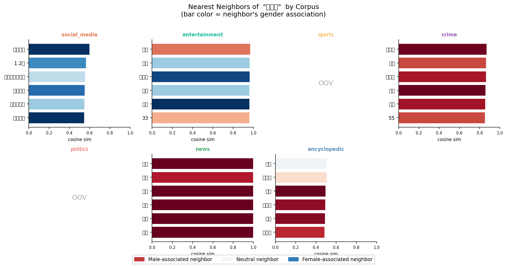
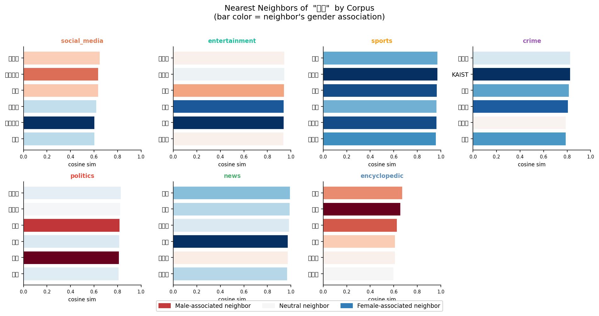
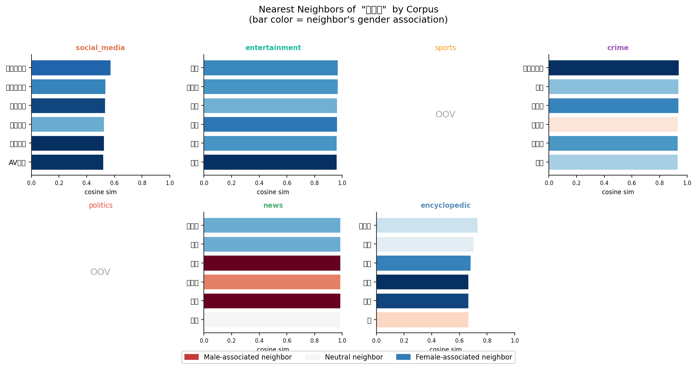
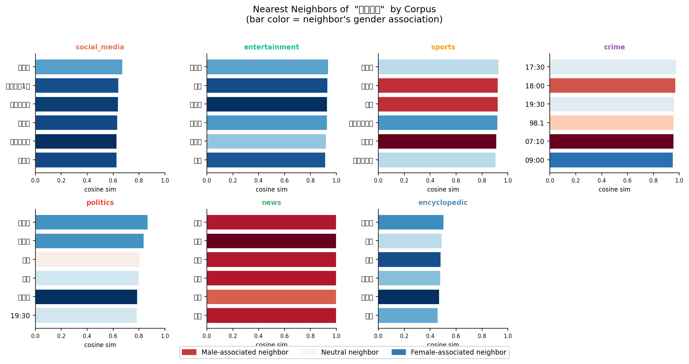

# Korean Word Embedding Bias — Multi-Domain Analysis

Extension of a prior WEAT-based analysis of gender-occupational bias in Korean word embeddings. The original study compared FastText (CC-100) and Word2Vec (Wikipedia/Namuwiki). This project adds five domain-specific corpora and a word-level qualitative analysis to examine whether bias is a property of corpus register or corpus domain.

---

## Research Questions

1. Do different Korean corpus registers (social media, encyclopedic, news) encode gender-occupational bias differently?
2. Does domain-specific news content (crime, politics, sports, entertainment) produce distinct bias patterns beyond what register alone predicts?
3. Can word-level nearest-neighbor analysis explain *why* certain domains show stronger or weaker WEAT effects?

---

## Method

**WEAT (Word Embedding Association Test)** — Caliskan et al. (2017)

Three tests, each measuring cosine-based association between target occupation sets and gender attribute sets:

| Test | Target X | Target Y | Attributes |
|---|---|---|---|
| T1 | Male-coded occupations | Female-coded occupations | Male vs. Female attrs |
| T2 | Neutral/Professional occupations | Female-coded occupations | Male vs. Female attrs |
| T3 | Neutral/Professional occupations | Male-coded occupations | Male vs. Female attrs |

T1 measures direct occupational stereotyping. T2 measures the "male default for expertise" — whether neutral professional roles (의사, 교수, 변호사) are implicitly male-coded. T3 is a directional control.

---

## Corpora

| Corpus | Source | Register | Size |
|---|---|---|---|
| Social Media | FastText CC-100 web crawl | Informal / UGC | — (pre-trained) |
| Encyclopedic | Word2Vec Wikipedia + Namuwiki | Formal / curated | — (pre-trained) |
| General News | Naver News + KLUE/MRC + KLUE/YNAT | Formal / journalistic | ~69K sentences |
| Crime | BIGKinds 사건/사고 | Formal / crime reporting | ~69K sentences |
| Politics | BIGKinds 정치 | Formal / institutional | ~59K sentences |
| Sports | BIGKinds 스포츠 | Semi-formal / domain-specific | ~66K sentences |
| Entertainment | BIGKinds 연예 | Informal / celebrity | ~67K sentences |

All domain corpora tokenized with KoNLPy Okt. Word2Vec: 200d, CBOW, window=5, min_count=2, 5 epochs.

---

## Results

### Main WEAT Results



| Corpus | T1 (d) | T2 (d) | T3 (d) |
|---|---|---|---|
| Social Media | **+1.41 \*** | **+1.37 \*** | −0.21 |
| Entertainment | **+0.86 \*** | +0.20 | −0.56 |
| Crime | +0.40 | +0.53 | +0.10 |
| Sports | +0.05 | +0.88 | +0.75 |
| Politics | +0.10 | −0.10 | −0.22 |
| Encyclopedic | +0.25 | −0.69 | −0.88 |
| General News | −0.17 | −0.08 | +0.04 |

\* p < 0.05



---

### Theoretical Framework: Register × Structural Gender Separation

To interpret the pattern, corpora can be positioned on two axes: **register formality** (informal ↔ formal) and **structural gender separation** (how strongly the domain keeps male and female referents in distinct semantic contexts).



T1 (direct stereotyping) tracks register informality. T2 (male default for expertise) tracks structural gender separation. These are empirically dissociable — sports is formal yet shows the highest T2 because its vocabulary systematically segregates male coaches/managers from female-coded contexts, while entertainment is informal and shows high T1 but near-zero T2 because female names and titles appear alongside professional ones.

---

## Word-Level Analysis

### Gender Association Heatmap

For each focus word, the gender association score is defined as s(w, MALE\_ATTRS) − s(w, FEMALE\_ATTRS). Positive scores indicate male-side association; negative scores indicate female-side association.



Key observations:
- **감독** (director/coach) shows the largest cross-corpus spread: strongly male in sports, near-neutral or female-side in entertainment
- **간호사** (nurse) is consistently female-coded across all corpora — the single most stable signal
- **여배우** (actress) and **아나운서** (announcer/presenter) are female-coded across the board, with entertainment showing the strongest female association — these two words are the primary drivers of entertainment's T1 significance
- **의사** (doctor) is male-coded in most corpora but weakens or reverses in crime, consistent with the medical fraud finding

### Case Study: 감독 Across Corpora

감독 is the single word that most sharply distinguishes sports T2 from entertainment T2.



In the **sports corpus**, 감독 clusters with 사령탑, 코치, and foreign manager names (램퍼드, 무리뉴) — a strongly male sports-management context. In the **entertainment corpus**, the same word clusters with film director names including female directors (변영주). The two corpora encode fundamentally different referents under the same lemma.

### Additional Neighbor Grids

<details>
<summary>의사 (doctor) — weakened by crime fraud context</summary>



In the crime corpus, 의사 clusters with 추징, 41억원, 800만원 — medical fraud and corruption contexts. This depresses T2 for crime relative to what a domain-amplification hypothesis would predict.
</details>

<details>
<summary>간호사 (nurse) — consistently female-coded</summary>


</details>

<details>
<summary>교수 (professor) — neutral expert role</summary>


</details>

<details>
<summary>여배우 (actress) — entertainment T1 driver</summary>


</details>

<details>
<summary>아나운서 (news presenter) — entertainment T1 driver</summary>


</details>

---

## Key Findings

**T1 and T2 measure distinct bias dimensions.** T1 (direct stereotyping) correlates with register informality: Social Media > Entertainment >> formal corpora. T2 (male default for expertise) correlates with structural gender separation: Sports and Social Media show the strongest effect, while formal news domains are near zero.

**Entertainment is unexpectedly high for T1.** The a priori prediction was low/uncertain bias; the observed d=+0.86 (p=0.049) challenges a simple register-formality account. Nearest-neighbor analysis reveals that entertainment embeddings associate 여배우 and 아나운서 with strongly female-coded contexts while 감독 clusters with male film director names — a direct occupational gender split encoded in the corpus.

**Sports shows T2/T3 elevation with flat T1.** 감독 (coach/director) in the sports corpus clusters with 사령탑, 코치, 램퍼드 — a strongly male sports-management context — while the same word in entertainment clusters with film directors including female directors (변영주). This single word accounts for a large share of the T2 divergence between the two domains.

**Crime news associates 의사 with fraud, not expertise.** Nearest neighbors include 추징, 41억원, 800만원 — medical fraud/corruption contexts. This depresses T2 relative to what the "crime amplifies gender bias" hypothesis would predict.

**Politics is flat across all tests — and this is itself a finding about WEAT's scope conditions.** Political reporting refers to actors by name (홍준표, 이재명) and institutional title (국회의원, 대통령) rather than generic occupational categories. The WEAT target words (군인, 간호사, 의사, …) simply do not co-occur with gender cues in political text the way they do in other domains. The null result suggests WEAT is most sensitive in domains where generic occupational labels are used as such — and less informative in domains dominated by person-specific reference. Low female-occupation vocabulary coverage (n_Y=4 for T1) further reduces reliability.

---

## Limitations

- Domain corpora cover a single 3-month window (2026-02-05 to 2026-05-02); time-series analysis would require multi-year BIGKinds exports.
- All domain Word2Vec models trained on ~60-70K sentences — smaller than the pre-trained baselines; effect sizes should be treated as lower bounds.
- The general news model produces near-degenerate embeddings (cosine similarities cluster near 1.0 across unrelated word pairs) and is excluded from interpretation. The likely cause is a combination of factors: the available Naver News dataset covers only economics and IT topics with no crime/society coverage, KLUE/YNAT headlines average 5–8 tokens and provide insufficient context for CBOW co-occurrence learning, and the resulting corpus lacks the topical diversity needed for occupation–gender co-occurrences to accumulate meaningfully. This is a methodological observation about corpus construction, not a general failure of the news register.
- Static embeddings only. Contextual models (KLUE-RoBERTa) may produce different patterns.
- Word sets are generic across domains; domain-adapted sets (e.g., sports-specific female occupations: 치어리더, 여자선수) would improve T1 coverage for sports and politics.

---

## Repo Structure

```
scripts/
  01_acquire_news_corpus.py      # Naver News + KLUE/MRC/YNAT tokenization
  02_train_news_w2v.py           # Word2Vec training (reusable for any domain)
  03_acquire_bigkinds_corpus.py  # BIGKinds Excel → tokenized corpus (--name domain)
  04_timeseries_weat.py          # Year-by-year WEAT (requires multi-year data)

src/
  weat.py                        # WEAT effect size + permutation test
  word_sets.py                   # Korean gender attribute and occupation word lists
  corpus_comparison.py           # Multi-corpus WEAT pipeline (auto-detects domains)
  visualize_comparison.py        # Grouped bars, divergence plot, 2×2 framework scatter
  neighbor_analysis.py           # Nearest-neighbor grids + gender association heatmap

results/
  csv/
    corpus_comparison.csv        # WEAT results for all corpora
    neighbor_analysis.csv        # Nearest-neighbor table for focus words
  figures/
    corpus_comparison_bars.png
    corpus_divergence.png
    framework_2x2.png
    neighbor_association_heatmap.png
    neighbors_감독.png  neighbors_의사.png  neighbors_간호사.png
    neighbors_교수.png  neighbors_아나운서.png  neighbors_여배우.png
```

---

## Reproducing the Analysis

### Prerequisites

```bash
pip install datasets konlpy gensim tqdm pandas matplotlib openpyxl
brew install openjdk ant   # macOS — required for KoNLPy
```

Pre-trained models required (not included — download separately):
- `models/cc.ko.300.bin` — FastText CC-100 Korean
- `models/ko.bin` — Kyubyong Word2Vec (Wikipedia + Namuwiki)

### Pipeline

```bash
# 1. General news corpus
python scripts/01_acquire_news_corpus.py
python scripts/02_train_news_w2v.py

# 2. BIGKinds domain corpora (repeat for each domain)
#    Expects: data/NewsResult_*_<name>.xlsx
python scripts/03_acquire_bigkinds_corpus.py --name crime
python scripts/02_train_news_w2v.py \
    --corpus data/crime_corpus_sentences.txt --output models/crime_w2v.bin
# (repeat for politics, sports, entertainment)

# 3. WEAT comparison (auto-detects all *_w2v.bin in models/)
python src/corpus_comparison.py

# 4. Visualizations
python src/visualize_comparison.py

# 5. Word-level analysis
python src/neighbor_analysis.py
```

### Time-series (when multi-year BIGKinds data available)

```bash
python scripts/04_timeseries_weat.py --min_years 2
```

---

## References

Caliskan, A., Bryson, J. J., & Narayanan, A. (2017). Semantics derived automatically from language corpora contain human-like biases. *Science*, 356(6334), 183–186.
